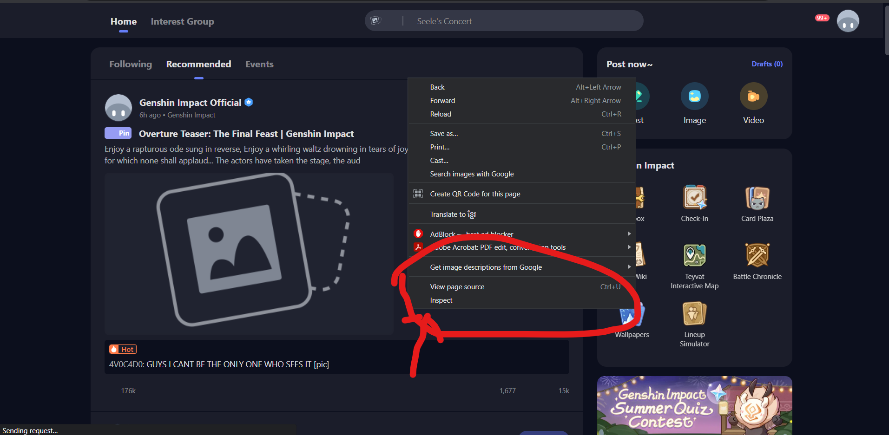
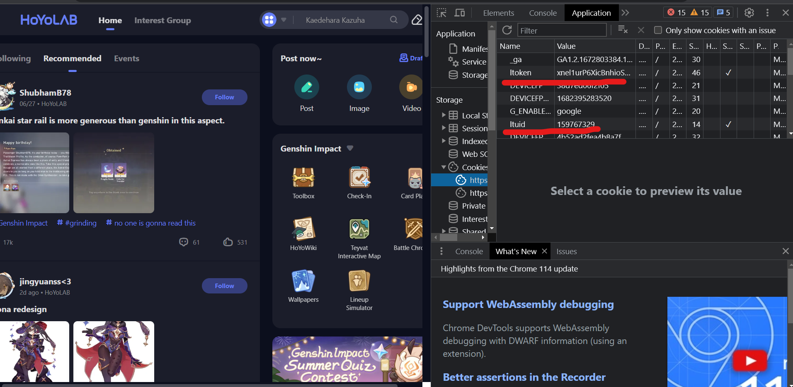

# Team-Randomizer
Randomizes teams with filters and different options

# Instructions
## Cloning the main repo
Type this command at the location you want to clone the repository
```
git clone "https://github.com/k1m-ch1/Team-Randomizer.git"
```
## Installing dependencies
Go into the **Team-Randomizer** directory and type in the command prompt (make sure that there's a **manage.py** and a **requirements.txt** file) (venv recommended)
```
pip install -r requirements.txt
```

## Running the server on local host
Go to **Team-Randomizer** directory and make sure **manage.py** is there

 ```
 python manage.py runserver
 ```

 ## Features
 ### register
 - Go to the registeration page at : */register*:
 - Click register and you should be automatically logged in
 ### login
 - If you already have an account, go to the login page at: */login*
 - Fill in your information correctly and you should be logged in

 ### Features when logged in
 - **NOTE:** Make sure that you enable show **character details**. Click on the **Edit** option beside your character's nickname. Select **Edit Profile**. Make sure **Show Character Details** is turned on.
 - Once logged in, you can automatically get access about your characters roster without having to fill in the information manually.
 - Go to */your-profile* to see the information you can save.
 - There should be a **uid**, **ltuid** and **ltoken** fields.
 #### uid
 - The uid is the user id of your account. This should be displayed at the bottom of your screen or at your profile when you are logged into your genshin account.
 #### how to get access to your ltuid and ltoken
 - The **ltuid** and **ltoken** will be availabe in your web browser once you login to [hoyolab](https://www.hoyolab.com/)
 <style>
 	figcap {
 		font-size: 1.2rem;
 		font-weight: bold;
 		text-align: center;
 	}

 	figure {
 		text-align: center;
 	}
 </style>
 <figure>
 	
 	<figcap>Right click and click on inspect element</figcap>
 </figure>
<figure>
 	
 	<figcap>Click on more</figcap>
 </figure>
<figure>
 	
 	<figcap>Click on applications</figcap>
 </figure>
 <figure>
 	
 	<figcap>Copy the **ltuid** and **ltoken** and then paste it into the fields in on your profile and click <b>Save</b></figcap>
 </figure>

### Saving user details
- There are two type of storage. 
1. **The local storage**: will be saved in your web browser and it doesn't require a login. (**NOTE:** it will reset if you clear your cache)
2. **The database**: requires a login and will be saved in a database in the backend. (**NOTE:** the database only saves your characters that it pulled from **hoyolab** and not the ones you manually saved)


# TODO
## Abyss randomizer
### Character selection
- [x] logic on how toggling between local storage mode and using your characters from the db
- [x] logic for when user is logged in or not
- [x] updating the checkbox
- [x] implement the select all button
- [ ] toggle the checkbox when you click on the character-card
- [ ] refactor the code
### Filter
- [x] create the filtering interface
- [x] filter the character selection interface when save
- ~~[ ] storing it into a localStorage in the client's side~~
### Randomizer UI and logic
- [x] create a randomize button and send it to an api
- [x] write the randomize api and send it back to the client
- [ ] create a randomizer user interface that will display the characters you've just randomized
#### Modes
n means use all characters, distribute as evenly as possible
k is constant, uses user input
- Mode 1: Create k teams of k length
- Mode 2: Create n teams of constant k length 
- Mode 3: Create k teams of n length
- Mode 4: Select k characters to randomize (need to check for 0 < k <= max_characters)
- Mode 5: Select all characters to randomize 

All of this can be done using one function
### Randomizer history
- [ ] display a randomizer history for localStorage for not logged in and store in database if logged in
- [ ] create a UI that displays your history in your profile if logged in
